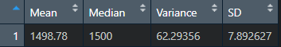
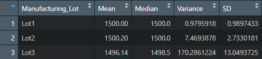
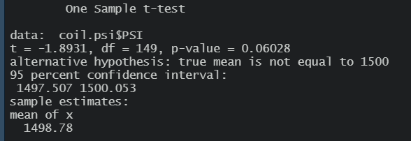
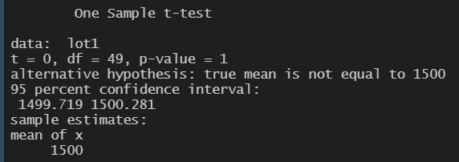
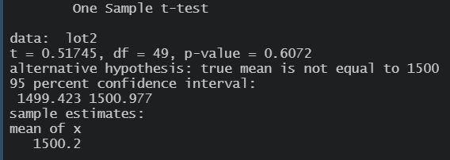
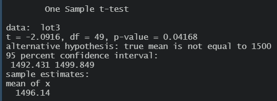

# MechaCar Statistical Analysis
## Linear Regression to Predict MPG
- Which variables/coefficients provided a non-random amount of variance to the mpg values in the dataset?
    - Vehicle Length and Vehicle Clearance both have p-value well below 0.05 and are the coefficients that provided non-random variance to the mpg values in the dataset.
- Is the slope of the linear model considered to be zero? Why or why not?
    - The overall p-value is well below 0.05, therefore the null hypothis that the  slope of the linear model is zero can be rejected (i.e. the slope is not considered to be zero) 
- Does this linear model predict mpg of MechaCar prototypes effectively? Why or why not?
    - The r-squared value is > 0.70 (70% of samples can be explained by the model) and p-value is significant, therefore we can say that the linear model will predict the MPG of MechCar prototypes effectively.

## Summary Statistics on Suspension Coils
The design specifications for the MechaCar suspension coils dictate that the variance of the suspension coils must not exceed 100 pounds per square inch (PSI).  

For the entire set of coils (Lots 1 through 3), the variance meets the specification as shown below (all values in PSI).

The variation in coil PSI increased for both Lots 2 & 3, with a substantial increase in Lot 3 that resulted in exceeding the allowed variance.

## T-Tests on Suspension Coils
When testing all lots together the p-value of the t-test that compares the PSI measurements for all of Lots 1-3 against the population is greater than 0.05. Therefore the null hypothesis, which states that there is no statistical difference between the sample and the population, cannot be rejected.  i.e., there is not a statistically significant difference in the PSI measurements between the population and the sample set containing all of Lots 1, 2, and 3.

Lot 1 has mean of 1500 PSI exactly with p-value of 1.  There is not a statistically significant difference between the population and Lot 1.

Lot 2 has a p-value greater than 0.05.  Though not as perfectly aligned with the population as Lot 1, there is still not a statistically significant difference for PSI measurements between the population and Lot 2.

Lot 3 has p-value under 0.05, meaning that there is a statistically significant difference for PSI measurements between the population and Lot 3.  Lot 3 should be inspected to understand the cause behind the difference.

## Study Design: MechaCar vs Competition
A potential statistical study to compare the performance of MechaCar to the competition would analyze the following key performance metrics that are of interest to consumers:
- Fuel Efficiency
- 0-60 Time

The study would determine if a correlation exists between vehicle weight, engine horsepower, and engine torque and the above performance metrics.  If a correlation exists it will also describe how strong the correlation is.  Hypotheses are as follows:
- H0(1):  The slope of the linear model describing the correlation between Fuel Efficiency and vehicle weight, engine horsepower, and engine torque is zero.
- Ha(1):  The slope of the linear model describing the correlation between Fuel Efficiency and vehicle weight, engine horsepower, and engine torque is not zero. 
- H0(2):  The slope of the linear model describing the correlation between 0-60 time and vehicle weight, engine horsepower, and engine torque is zero.
- Ha(2):  The slope of the linear model describing the correlation between 0-60 time and vehicle weight, engine horsepower, and engine torque is not zero. 

Because the hypotheses reference a correlation between several variables, the hypotheses would be tested using a multiple linear regression test.  In order to complete this test, the following would data would need to be needed:
- Fuel Efficiency (city and highway)
- 0-60 Times
- Vehicle Weight
- Engine Horsepower (max)
- Engine Torque (max)